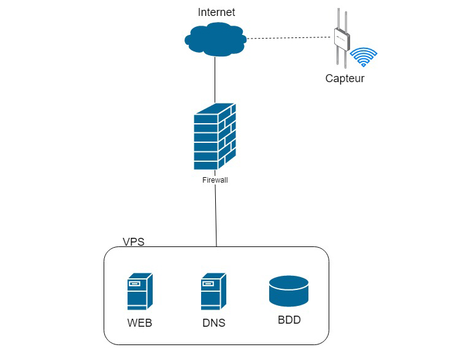

# Description du projet

Ce projet consiste en l'intégration des différents techniques afin d'arriver à un système de partage de graine qui aidera les futurs agriculteurs amateurs.
Le site étant gratuit, nos clients auront la possibilité d'accéder au maximum des ressources mises à leur disposition afin de trouver les graines parfaites pour leur potager.

Un appareil de suivi de la température et de l'humidité de leur serre sera proposé pour tout client désireux de suivre plus en détail leur potager et ainsi optimiser au mieux la pousse et les récoltes.
Cet appareil sera peu encombrant et ne nécessitera que d'un câble d'alimentation ainsi que d'un accès à internet.

## Liens utiles et outils

Concernant ce projet, voici les liens et outils que nous nous servont :

* _**GitHub**_ : <https://github.com/melvinmajor/seed-IT>
* _**Trello**_ : <https://trello.com/b/XEX3CKmq>
* _**Docker Hub**_ : <https://cloud.docker.com/repository/docker/melvinmajor/seed-it>

Nous avons par ailleurs utilisé un groupe de communication privé dans _**Microsoft Teams**_, tout comme _**Toggl**_ comme outil de timesheet.

# Bilan du Sprint

## Avancement technique

Dû à un conflit de connexion internet nécessitant une intervention plus conséquente et nécessitant un certain temps, nous n'avons pu déployer les différents services sur le VPS (= serveur dédié virtuel).

Malgré tout, nous avons avancé sur la partie web front-end et avons préparé le nécessaire pour pouvoir lancer les différents services dès la résolution du problème.
Nous avons également analysé le matériel nécessaire à l'avancement de ce projet, à savoir une Raspberry Pi, le capteur température/humidité ainsi que les langages de programmation pour les différents services et la Raspberry Pi.

Une première reflexion à été faite concernant la partie base de données et web back-end.

## Méthodologie et gestion d'équipe

Pour la gestion de notre équipe, nous avons eu des nombreuses réunions afin de se mettre d'accord sur la manière de concevoir le projet.
Durant chaque rencontre nous avons utilisé la méthode Poker et nous nous sommes tous mis d'accord sur les manières de gestion de partage et communication telle que Microsoft Teams, Trello, GitHub et DockerHub.
Aucune décision n'a été prise avant que tous les membres soient d'accord.

## Analyse réflexive du fonctionnement du groupe

Durant ce sprint nous avons eu besoin de nous souder en tant qu’équipe. Le plus difficile durant cette période était la communication Belgique – Malte, mais surtout la séparation des taches, car certains membres ne voulaient pas respecter leurs rôles.
Du point de vue technique nous commençons la finalisation de la mise en place des VPS, et nous voulons finir le design et la structure du site web. 

# Objectifs du Sprint

## User Stories

* Logo du site web _(Sprint 1, 5 points)_
  * _**Responsable :**_ Filipp Shatskiy
  * _**Description :**_ en tant que client, je souhaite avoir un logo représentant au mieux l'idée derrière ce projet.
  * _**Tâches :**_
    * Création du logo,
    * Création d'une palette de couleurs : permet de faire en sorte que les couleurs d'accentuation du site internet correspondent avec le logo tout en gardant une certaine homogéïnité.
* Contenu du site web _(Sprint 1, 1 point)_
  * _**Responsable :**_ Constantin Mirica
  * _**Description :**_ en tant que client, je souhaite avoir une proposition de contenu pour le site internet.
  * _**Tâches :**_
    * Contenu des pages "Accueil".
* Mise en place d'une version simple du site web _(Sprint 1, 3 points)_
  * _**Responsable :**_ Hymed Boussaklatan
  * _**Description :**_ en tant qu'utilisateur, je souhaite avoir un site internet permettant de proposer mes graines de plantes à la vente.
  * _**Tâches :**_
    * Créer les pages "Accueil", "Boutique", "A propos" et "Contact",
    * Réfléchir à une idée de design pour le prochain Sprint.

## Technical Stories

* Achat du VPS et du nom de domaine _(Sprint 1, 0.5 points)_
  * _**Responsable :**_ Melvin Campos Casares
  * _**Description :**_ achat auprès du fournisseur d'accès d'un serveur privé virtuel (VPS) et du nom de domaine.
  * _**Tâches :**_
    * Choisir le nom de domaine,
    * Commander le VPS et le nom de domaine,
    * Configurer auprès d'OVH le lien entre VPS et nom de domaine.
* Démarrage des services sur le VPS _(Sprint 1, 15 points)_
  * _**Responsables :**_ l'équipe entière
  * _**Description :**_ mise en place des services nécessaire sur le VPS pour le bon démarrage du projet.
  * _**Tâches :**_
    * Service Web sous Apache,
    * Base de données,
    * Reverse Proxy,
    * Pare-feu,
    * Sécurisation (Fail2ban, SSH).

## Bug

Nous n'arrivons pas pour le moment à lier nos services avec le serveur DNS de chez OVH.

Le bug n'est toujours pas résolu car pour le moment nous devons attendre la propagation DNS sur notre VPS.

# Timesheet

Les autres membres du groupe ont travaillé mais n'ont pas fourni à temps leur timesheet.
Cela sera reglé pour le prochain Sprint.

| Nom | Date | Durée | Description |
|-----|------|-------|-------------|
| Melvin | 19/09/2019 | 7 minutes | Mise en place de l'outil GitHub et Microsoft Teams |
| Melvin | 22/09/2019 | 12 minutes | Création du compte sur le VPS + SSH et configuration de base |
| Melvin | 24/09/2019 | 4 minutes et 37 secondes | Changement des zones DNS du nom de domaine (A et AAAA) |
| Melvin | 30/09/2019 | 45 minutes | Rapport |
| Melvin | 02/10/2019 | 48 minutes et 39 secondes | Optimisation du site web (partie frontend) |
| Constantin | 19/09/2019 | 30 minutes | Mise en place des outils Trello et Toggl |
| Constantin | 30/09/2019 | 1 heure | Gestion des conflits entre les membres et suivi des tâches assigné à chaque membre |
| Constantin | 01/10/2019 | 20 minutes | Gestion des conflits entre les membres |
| Melvin & Constantin | 02/10/2019 | 1 heure | Rapport |

## Réunions

Deux réunions ont été organisé durant ce Sprint :

* 19/09/2019 : Réunion entre tous les membres du projet.
  * _Durée :_ 1 heure
  * Discussion sur le sujet retenu pour le projet d'intégration, des atouts de chacun des membres et des outils qui seront mis en place.
* 02/10/2019 : Réunion entre Hymed, Nathan, Antoine et Constantin.
  * _Durée :_ 40 minutes
  * Discussion sur la structure de la base de données et des interactions utilisateur.

# Schémas et analyses

# Tests

# Equipe

Avant de commencer le partage de tâches, nous avons fait le test du DISC qui consiste à analyser les types de comportement de chaque membre.
Nous trouvons que c'est essentiel de mettre en avant les points forts et essayer même d'améliorer les points faibles des membres de notre groupe.

Avant même la conceptualisation du projet et du brainstorm, nous avons mis ensemble en groupe restreint afin d’analyser les qualités et les différents profils dont nous avons besoin dans une équipe capable de surmonter tout projet.

Premièrement l’équipe nécessitait une charte bien définie avec tous les postes disponibles et les responsabilités bien encadrées.
Pour faire cela, nous nous sommes basés sur l’intégralité des autres projets réalisés et sur un squelette hypothétique de notre idée.
Suite à cette analyse nous concluons que les besoins RH sont les suivants :

* Responsable communication
* Responsable équipe
* Responsable marketing
* Responsable web
* Responsable IoT
* Responsable virtualisation
* Responsable sécurité

Deuxièmement nous avons choisi des coéquipiers qui sont très doués dans leurs domaines, deux, trois par poste, afin de faire une sélection plus précise.
Après des négociations pour les différents postes nous avons su allouer les places, en fonction des tests de leurs personnalités.

Notre équipe n’est pas faite à base d’amitié mais à base de confiance, efficacité, et mélange équilibré de toutes les personnalités :

| J     | V    | R     | B    |
|-------|------|-------|------|
| Jaune | Vert | Rouge | Bleu |

* Communication : Campos _(JV)_ - Product Owner
* Equipe : Mirica _(BV)_ - Scrum Master
* Marketing : Filipp _(JV)_
* Web : Hoebar _(JV)_
* IoT : Nathan _(VB)_
* Virtualisation : Hymed _(RJ)_
* Sécurité : Hubert _(V)_

La colorimétrie correspond au test de personnalité DISC et comme vous pouvez le remarquer, nous avons choisi un seul membre qui a une personnalité plus « vive », car suite à nos analyses c’est le meilleur choix.

## Estimation de la vélocité de l'équipe

Pour le moment, nous avons essayé de faire la meilleure géstion de temps.
Cette premiére experience était extrêmement fructueuse, malgré certaines disputes.
Les differents

## Forces et faiblesses du Sprint précédant et mesures prises

### Forces
Le démarrage technique était très bon car notre gestion du projet nous a permis de lancer une idée fiable.

### Faiblesses
Le voyage de Malte et la mauvaise entente au sein du groupe ont amené beaucoup de disputes. Les caractères divergents des membres ont créé des animosités malgré leurs capacités techniques.
Étant donné qu'il s'agit du premier sprint, nous n'avons pu nous baser que sur l'analyse réalisée par le _Scrum Master_ afin de prendre des mesures adaptées.

# Objectif du prochain Sprint

* TS : Démarrage des services sur le VPS _(Sprint 2, 2 points)_
  * _**Responsables :**_ l'équipe entière
  * _**Description :**_ mise en place des services nécessaire sur le VPS pour le bon démarrage du projet.
  * _**Tâches :**_
    * Démarrer les services préparé lors du Sprint 1
* TS : Commander le capteur température/humidité
  * _**Responsable :**_ Melvin Campos Casares
  * _**Description :**_ commande du capteur de température/humidité sélectionné pour ce projet et fonctionnant avec la Raspberry Pi.
  * _**Tâche :**_
    * Commander le module AM2302 auprès d'un fournisseur.
* TS : Création de la base de données _(Sprint 2, 10 points)_
  * _**Responsables :**_ Antoine Hoebaer et Nathan Henry
  * _**Description :**_ Démarrage de la partie base de données suite aux réflexion de la dernière réunion
  * _**Tâches :**_
    * Création de la base de données
    * Mise en place de la base de données sur le VPS
    * Réflexion sur l'avancement avancé pour le prochain Sprint

* US : CSS du site web _(Sprint 2, 2 points)_
  * _**Responsable :**_ Melvin Campos Casares
  * _**Description :**_ en tant que client, je souhaite avoir une proposition de design final pour le site internet
  * _**Tâches :**_
    * Design du site internet au complet
* US : Contenu du site web _(Sprint 2, 3 points)_
  * _**Responsable :**_ Constantin Mirica
  * _**Description :**_ en tant que client, je souhaite avoir une proposition de contenu pour les autres pages du site internet
  * _**Tâches :**_
    * Contenu des pages "A propos", "Contact" et "Boutique"
